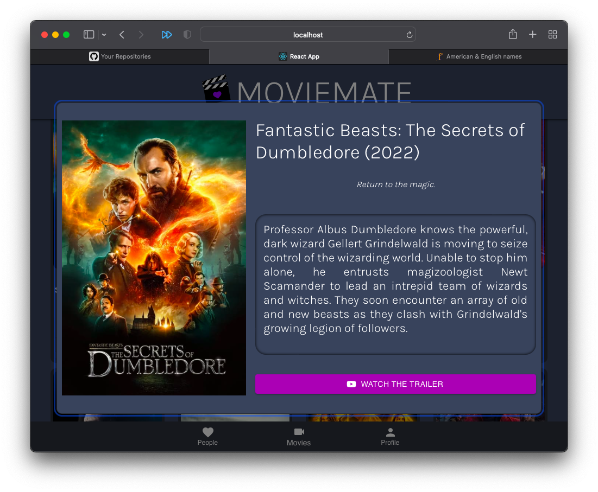
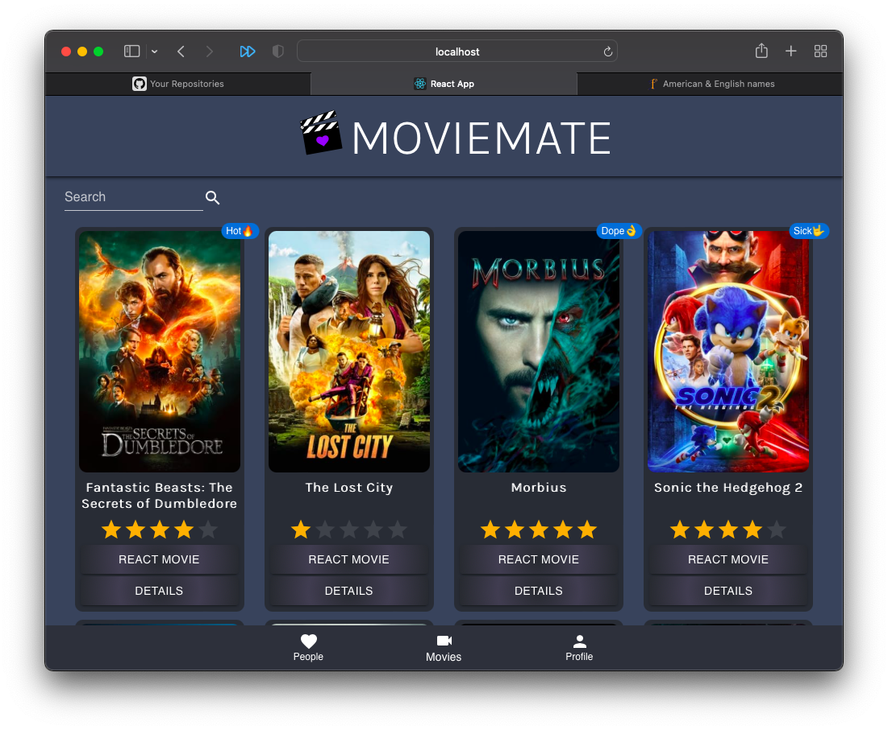
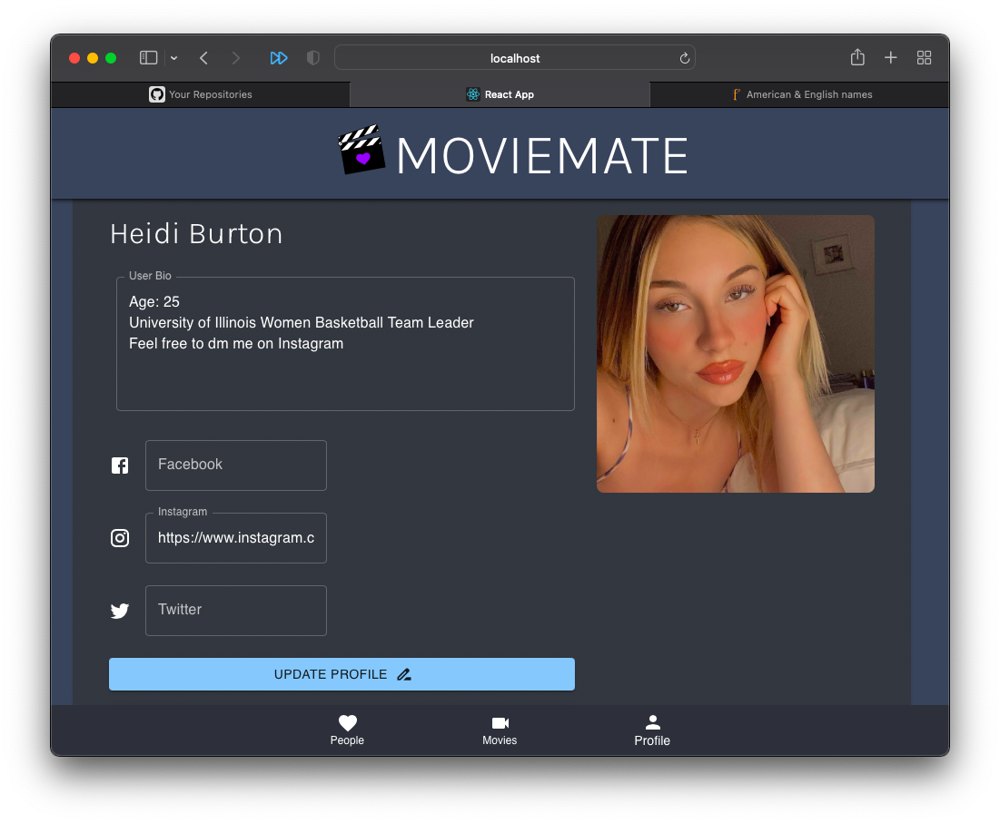
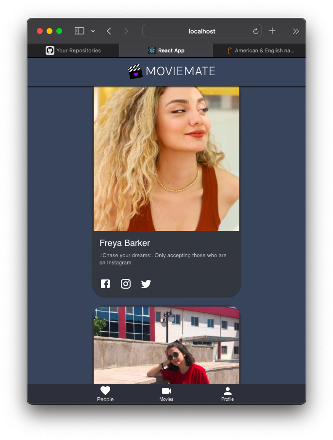
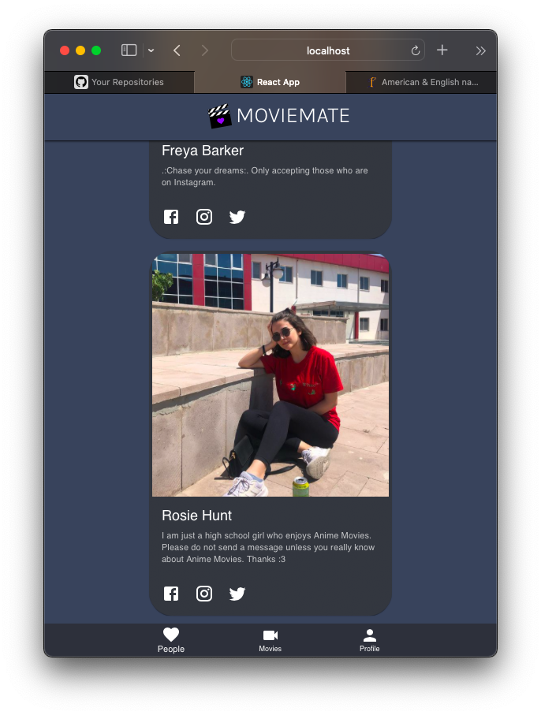

# MovieMate Web Application
MovieMate is a well developed web application that matches users with each other based on their ratings of movies. We aim to match users with the same movie enjoyment by running highly selective algorithms in the background.

## Simple Run of the Application
Users can view detailed information and trailer videos of the movies at the Movies page in MovieMate.

Since this web application matches people according to their favorite movies, users can rate movies by giving up to 5 stars or by giving reaction emojis to classify the movies.

Users can customize their profiles by changing their profile pictures, profile bios, social media links and any information about themselves.

Users can reach recommended people through the web application.

